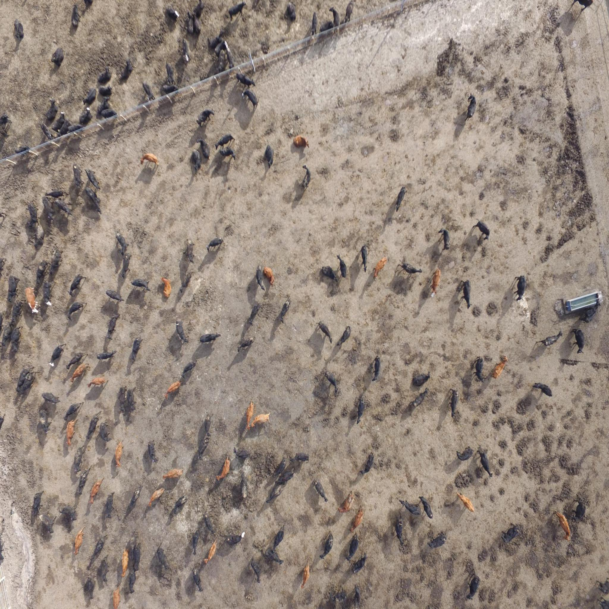
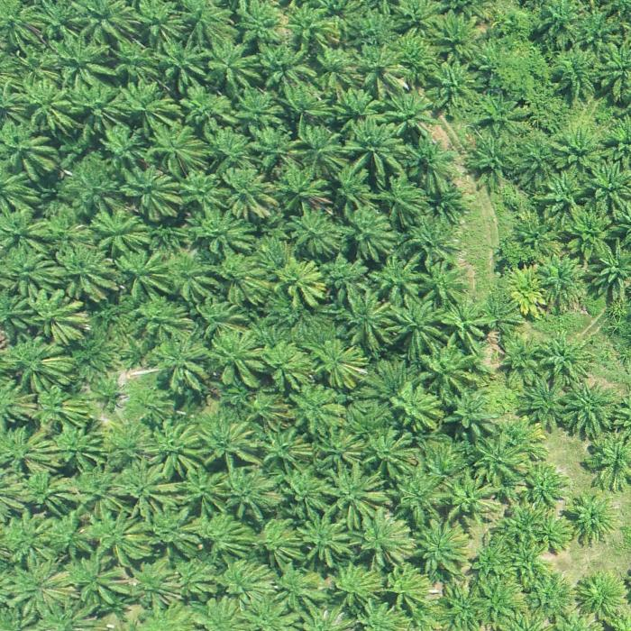
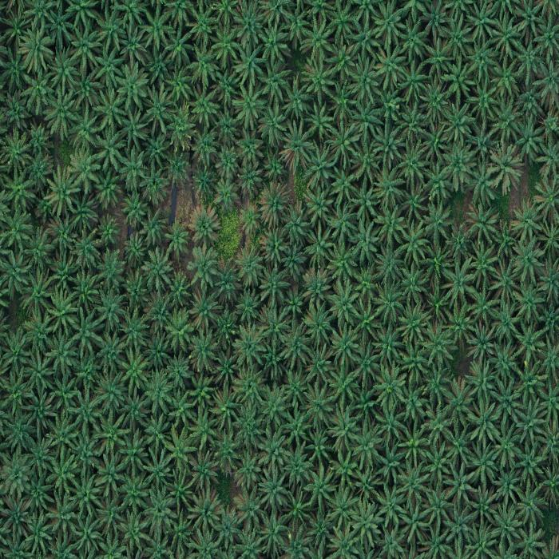
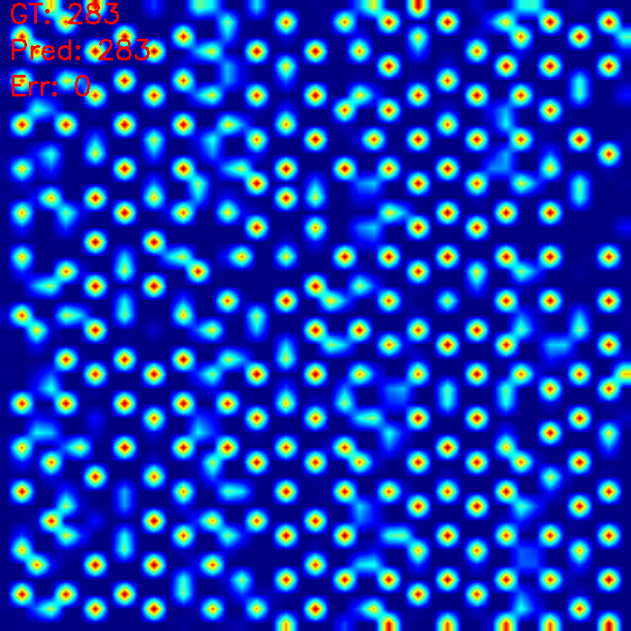
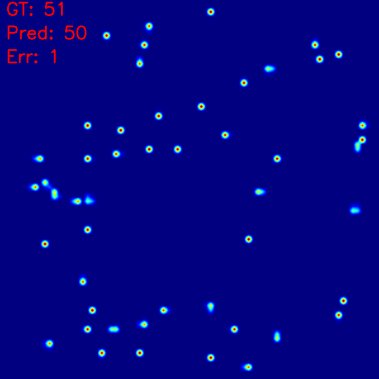

# Object Counting with CLIP-EBC

This project is based on the paper: **[CLIP-EBC: CLIP-Guided Efficient Box-Free Object Counting](https://arxiv.org/abs/2308.13741)** (ICCV 2023)

---

## 🔍 Overview

This project presents a cutting-edge object counting approach that integrates the rich semantic understanding of CLIP with the lightweight efficiency of the Enhanced Blockwise Classification (EBC) framework. By leveraging natural language prompts to guide the counting process, this method delivers accurate, adaptable, and prompt-driven object counting across diverse datasets and complex visual scenarios.

---

## 🧩 Features

- **CLIP-Guided Semantics**: Utilizes the power of CLIP to align visual features with language prompts for robust object understanding.

- **Enhanced Blockwise Classification (EBC)**: Improves traditional blockwise counting by introducing integer-valued bins and a joint classification-regression loss (DACE). This design eliminates boundary ambiguity and enables accurate count learning even in heavily crowded, overlapping, or small-object-dominated scenes.

- **Flexible Backbone Support**: Compatible with multiple architectures (ResNet, CLIP-ViT,...) - flexible for various deployment needs

- **Strong Quantitative Results**: Achieves competitive MAE, RMSE, and Accuracy metrics across multiple challenging benchmarks, especially in crowd counting scenarios.

- **Visual Interpretability**: Produces density heatmap to visualize model focus and counting regions.

---

## 📊 Experiments on Datasets

We evaluate our CLIP-EBC approach on several challenging object counting benchmarks to demonstrate its robustness and generalization:

### 🧍‍♂️ Crowd Counting – ShanghaiTech B Dataset:

A crowd counting benchmark featuring pedestrian scenes in urban streets.

  
  
  
  

### 🐮 Cow Counting Dataset

Counting cows in outdoor farm environments.

  
  
  
  

### 🌳 Tree Counting Dataset

Counting oil palm trees from aerial forest imagery.

  
  
  
  

### 🦐 Shrimp Counting Dataset

Counting shrimp in aquaculture farming environment

  
  
  
  

## 📊 Quantitative Results

We evaluate the CLIP-EBC model using standard metrics: **MAE** (Mean Absolute Error), **RMSE** (Root Mean Squared Error), and **Accuracy** on the four datasets above
### 📐 Metric Definitions:
- **MAE (Mean Absolute Error)**: Measures the average absolute difference between prediction and groundtruth.
- **RMSE (Root Mean Squared Error)**: Similar to MAE but penalizes larger errors more heavily.
- **Accuracy**: Measures how close the predicted count is to the ground truth.
  
| Dataset                 | MAE ↓ | RMSE ↓ | Accuracy ↑ |
|-------------------------|-------|--------|------------|
| ShanghaiTechB           | 8.1   | 13.2   | 93.4%      |
| Cow Counting            | 2.6   | 3.9    | 95.8%      |
| Tree Counting           | 10.2  | 66.1   | 89.3%      |
| Shrimp Counting         | 1.5   | 2.4    | 93.3%      |

> *Note: All experiments use CLIP-ResNet50 as the backbone for the pipeline.

## 🎨 Visualizations

Below are some examples in testing results for each dataset:

### 🧍‍♂️ Crowd Counting – ShanghaiTechB Dataset

  
  
  &nbsp;&nbsp;&nbsp;&nbsp;&nbsp;&nbsp;&nbsp;&nbsp;
  
  

### 🐮 Cow Counting Dataset

  
  
  &nbsp;&nbsp;&nbsp;&nbsp;&nbsp;&nbsp;&nbsp;&nbsp;
  
  

### 🌳 Tree Counting Dataset

  
  
  &nbsp;&nbsp;&nbsp;&nbsp;&nbsp;&nbsp;&nbsp;&nbsp;
  
  

### 🦐 Shrimp Counting Dataset

  
  
  &nbsp;&nbsp;&nbsp;&nbsp;&nbsp;&nbsp;&nbsp;&nbsp;
  
  

> 📌 *Each example shows: Left – Original Image, Right – Result Image with density estimation.*

